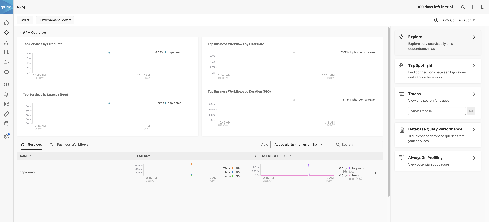
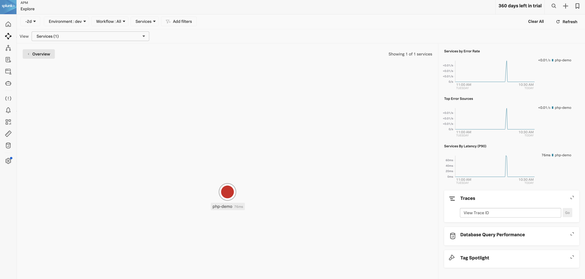

# splunk-otel-laravel-k8s

In this article, we will walk through the steps to 
- Containerize a simple PHP application
- Instrumenting with Splunk PHP agent
- Deploy into kubernetes cluster

The exact [article](https://learnk8s.io/blog/kubernetes-deploy-laravel-the-easy-way) 

# Signalfx PHP Instrumentation

